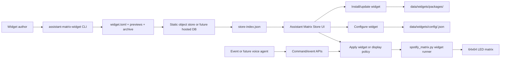

# Assistant Matrix Widget Store Roadmap

## Product Direction

Assistant Matrix should evolve from a fixed set of built-in display modes into a small widget platform for a Raspberry Pi-powered LED matrix.

The Pi app should be able to:

- Browse a widget store.
- Preview how a widget looks before installing it.
- Download and install widgets locally.
- Configure each widget from the Assistant Matrix UI.
- Run one widget continuously.
- Rotate through multiple widgets on a schedule.
- Auto-trigger widgets from events, such as Spotify playback starting.
- Expose stable APIs so a future voice agent, phone UI, or automation service can control the same display system.

The store can start as a static object store and later become a database-backed service.

## Current Codebase Fit

The repo already has useful foundations:

- `src/api/http/rest/` exposes FastAPI routes.
- `src/domain/models/api_schemas.py` defines persisted config and API models.
- `src/domain/services/config_service.py` persists local config under `data/config.json`.
- `src/domain/services/runtime_service.py` supervises the display runtime.
- `src/api/http/rest/commands.py` gives future agents a command-oriented API.
- `spotify_matrix.py` contains current renderers for Spotify, Clock, Agent, Weather, and Test Pattern.

The current branch has introduced that widget registry and the supporting store, SDK, install, policy, and command APIs. The remaining work is mostly product hardening, richer UI polish, dependency isolation for third-party widgets, and an optional hosted database-backed store.

For a command-by-command walkthrough, see [Widget Store Quickstart](widget-store-quickstart.md).

## Implementation Status

Implemented in this branch:

- Local widget registry with built-in `core.*` widgets and installed store widgets.
- Static widget store index loading from HTTP(S) or a local file path.
- Store browse/install/update behavior in the UI and backend.
- Local widget config persistence and apply APIs.
- External Python widget package execution through `spotify_matrix.py --display-mode widget`.
- Display policy for single-widget mode and scheduled rotation.
- Event triggers with priority and minimum display duration.
- Command API support for applying widgets and submitting events.
- Python SDK primitives for canvas rendering, context, config fields, permissions, previews, and triggers.
- Author CLI for scaffold, manifest generation, preview rendering, validation, packaging, and static-store publishing.
- Package publishing validation and device-side install validation.

Still intentionally future work:

- Third-party dependency isolation beyond the app environment.
- A database-backed hosted store with accounts, approvals, ratings, and private widgets.
- Event history in the UI.
- True in-process hot swapping; V1 still restarts the display runtime on apply.
- A richer widget-builder/visualizer UI for non-code authors.

## Core Concepts

### Widget

A widget is a packaged display capability. Examples:

- Spotify now playing
- Clock
- Weather
- Agent face
- Calendar
- Tasks
- YouTube Music
- Custom image board

A widget owns:

- metadata
- preview media
- config schema
- renderer entrypoint
- optional event triggers
- optional permissions

### Local Widget

A local widget is an installed widget on the Pi. It has:

- widget package files
- installed version
- saved user config
- enabled/disabled state
- runtime state

### Playlist

A playlist decides what the display runs over time.

Example:

```json
{
  "mode": "rotation",
  "items": [
    {"widgetId": "core.weather", "durationSeconds": 60},
    {"widgetId": "core.clock", "durationSeconds": 30},
    {"widgetId": "core.agent", "durationSeconds": 15}
  ]
}
```

### Trigger

A trigger temporarily overrides the current display.

Examples:

- Spotify starts playing -> show Spotify widget.
- Weather alert -> show weather alert widget.
- Voice command -> switch to clock.
- Calendar event starting soon -> show calendar widget.

## Widget Package Structure

Recommended package layout:

```text
widget.toml
README.md
previews/
  card.gif
  matrix-64.png
renderer/
  widget.py
assets/
  optional-images-or-fonts
```

For Python widgets, `renderer/widget.py` should expose a small stable interface:

```python
from assistant_matrix_sdk import MatrixCanvas, WidgetContext


def render(canvas: MatrixCanvas, context: WidgetContext) -> None:
    config = context.config
    state = context.state
    canvas.clear("#000000")
    canvas.text(2, 2, "Hello", color="#ffffff")
```

Long-running widgets can optionally expose lifecycle hooks:

```python
def setup(context: WidgetContext) -> None:
    pass


def tick(context: WidgetContext) -> None:
    pass


def teardown(context: WidgetContext) -> None:
    pass
```

## Widget Manifest

The manifest should be the contract between the store, the local app, the UI, and the SDK.

Example `widget.toml`:

```toml
[widget]
id = "core.weather"
name = "Weather"
version = "1.0.0"
summary = "Current weather, AQI, UV, wind, and playful assistant scenes."
author = "Assistant Matrix"
category = "information"
runtime = "python"
entrypoint = "renderer.widget:render"
matrix_size = "64x64"
license = "MIT"

[preview]
card_gif = "previews/card.gif"
matrix_png = "previews/matrix-64.png"

[[permissions]]
name = "network"
reason = "Fetches weather and air-quality data."

[[config]]
key = "postalCode"
label = "ZIP / postal code"
type = "string"
required = true
placeholder = "60601"

[[config]]
key = "countryCode"
label = "Country"
type = "select"
default = "US"
options = ["US", "CA", "GB", "IN"]

[[config]]
key = "temperatureUnit"
label = "Temperature unit"
type = "select"
default = "fahrenheit"
options = ["fahrenheit", "celsius"]

[[triggers]]
event = "schedule.interval"
default_enabled = true
```

## Store Metadata

The first store can be a static JSON index hosted from GitHub Pages, S3, R2, or another object store.

Example `store-index.json`:

```json
{
  "schemaVersion": 1,
  "widgets": [
    {
      "id": "core.weather",
      "name": "Weather",
      "version": "1.0.0",
      "summary": "Weather, AQI, UV, wind, and assistant scenes.",
      "category": "information",
      "author": "Assistant Matrix",
      "manifestUrl": "https://store.example.com/widgets/core.weather/1.0.0/widget.toml",
      "archiveUrl": "https://store.example.com/widgets/core.weather/1.0.0/widget.tar.gz",
      "previewGifUrl": "https://store.example.com/widgets/core.weather/1.0.0/previews/card.gif",
      "matrixPreviewUrl": "https://store.example.com/widgets/core.weather/1.0.0/previews/matrix-64.png",
      "sha256": "..."
    }
  ]
}
```

Later, this can move to a database-backed service with user accounts, approvals, ratings, and private widgets.

V1 publishing can write directly to a static object-store layout:

```bash
assistant-matrix-widget publish ./my-widget --store-dir ./store-dist --base-url https://store.example.com
```

This produces:

```text
store-dist/store-index.json
store-dist/widgets/<widget-id>/<version>/widget.toml
store-dist/widgets/<widget-id>/<version>/<widget-id>-<version>.tar.gz
store-dist/widgets/<widget-id>/<version>/previews/...
```

The Pi only needs the public index URL. It can browse the index, install an archive, persist widget config, and run the package locally.

## End-To-End Workflow



The same installed widget can be:

- applied directly with `POST /api/widgets/local/{widget_id}/apply`
- selected by `POST /api/commands` using `set_widget`
- placed into rotation through `POST /api/display/policy`
- triggered temporarily through `POST /api/display/events` or the `trigger_event` command

On the device, configure the store source in Assistant Matrix settings:

```json
{
  "store": {
    "indexUrl": "https://store.example.com/store-index.json"
  }
}
```

`store.indexUrl` can be an HTTP(S) URL or a local file path. The `ASSISTANT_MATRIX_WIDGET_STORE_INDEX` environment variable still overrides this value for deployments that prefer immutable container config.

## Local Storage

Recommended Pi local layout:

```text
data/
  config.json
  spotify_token.json
  widgets/
    installed.json
    packages/
      core.weather/
        1.0.0/
          widget.toml
          renderer/
          previews/
    configs/
      core.weather.json
  schedules/
    active-playlist.json
```

## Fixed Local APIs

For the current implemented API contract, see [docs/widget-api-reference.md](widget-api-reference.md).

### Store

```text
GET  /api/widgets/store
GET  /api/widgets/store/{widget_id}
POST /api/widgets/install
```

### Local Widgets

```text
GET    /api/widgets/local
GET    /api/widgets/local/{widget_id}
DELETE /api/widgets/local/{widget_id}
GET    /api/widgets/local/{widget_id}/config
POST   /api/widgets/local/{widget_id}/config
POST   /api/widgets/local/{widget_id}/apply
```

Lifecycle behavior:

- `POST /api/widgets/install` installs or updates the store widget by id.
- `DELETE /api/widgets/local/{widget_id}` uninstalls downloaded widgets, removes package files, removes saved widget config, removes display policy references, and falls back away from the removed widget if it was active.
- Built-in `core.*` widgets are part of the app and are not uninstallable.

Installed Python widgets become runnable when the store entry points to a reachable `.tar.gz` archive. The archive is unpacked under:

```text
data/widgets/packages/<widget-id>/
```

The app reads `widget.toml`, renders config fields from the manifest, stores user config under:

```text
data/widgets/config/<widget-id>.json
```

and launches the runtime with:

```text
spotify_matrix.py --display-mode widget --widget-dir data/widgets/packages/<widget-id> --widget-config data/widgets/config/<widget-id>.json
```

Store entries without a reachable archive can still be shown as catalog metadata, but they are not runnable until the package is available locally.

### Display Policy and Events

The current runtime control surface is policy-based:

```text
GET  /api/display/policy
POST /api/display/policy
POST /api/display/policy/apply
POST /api/display/policy/stop
GET  /api/display/policy/state
POST /api/display/events
```

Current event trigger API:

```text
POST /api/display/events
```

Example:

```json
{
  "event": "spotify.playback_started",
  "payload": {
    "source": "spotify"
  }
}
```

The runner compares the event with saved `policy.triggers`, chooses the enabled rule with the highest priority, applies that widget, and resumes the saved display policy after `minDurationSeconds`.

### Commands

The `/api/commands` endpoint is the stable command surface for future voice agents and automations.

```json
{
  "command": "set_widget",
  "value": "core.weather"
}
```

Current widget-relevant commands:

- `set_widget`
- `trigger_event`
- `set_mode`
- `set_clock_face`
- `set_brightness`
- `start_runtime`
- `stop_runtime`

## SDK Shape

The SDK should hide low-level Pillow and matrix details from widget authors.

Example:

```python
from assistant_matrix_sdk import Widget, ConfigField


class WeatherWidget(Widget):
    id = "core.weather"
    name = "Weather"

    config = [
        ConfigField.string("postalCode", label="ZIP / postal code", required=True),
        ConfigField.select("temperatureUnit", ["fahrenheit", "celsius"], default="fahrenheit"),
    ]

    def render(self, canvas, context):
        canvas.background("#08101c")
        canvas.text(2, 2, context.config["postalCode"], color="#ffffff")
```

Core SDK objects:

- `MatrixCanvas`
- `WidgetContext`
- `ConfigField`
- `Widget`
- `Event`
- `Asset`

Canvas helpers:

- `clear(color)`
- `background(color)`
- `text(x, y, value, color)`
- `rect(x, y, w, h, color)`
- `circle(x, y, r, color)`
- `line(x1, y1, x2, y2, color)`
- `image(path, x, y, size)`
- `frame()` for animations

## Publishing Workflow

Developer flow:

```bash
assistant-matrix-widget init user.weather
assistant-matrix-widget preview renderer.widget:UserWeatherWidget --output previews/matrix-64.png
assistant-matrix-widget validate widget.toml
assistant-matrix-widget package . --output-dir dist
assistant-matrix-widget publish . --store-dir store-dist --base-url https://store.example.com
```

Validation should check:

- manifest is valid
- config fields are renderable by the UI
- preview media exists
- widget renders at least one 64x64 frame
- package has no unexpected files
- requested permissions are declared
- archive hash matches store metadata

Publishing metadata should include:

- widget id
- name
- summary
- version
- author
- category
- preview GIF
- 64x64 static preview
- config schema
- permissions
- supported matrix sizes
- runtime type
- entrypoint
- changelog
- license
- source URL

## Runtime Strategy

V1 should keep the current restart-on-apply behavior because it is simple and stable.

V2 should introduce a widget runner that can switch widgets without restarting the whole FastAPI service.

Recommended process model:

```text
FastAPI app
  controls config, store, install, commands

Widget runner process
  loads active widget
  renders frames
  owns matrix output

Optional device controller process
  controls Wi-Fi, Bluetooth, audio, host services
```

## Scheduling and Triggers

Scheduling should be data-driven.

Example active display policy:

```json
{
  "defaultMode": "rotation",
  "rotation": [
    {"widgetId": "core.weather", "durationSeconds": 90},
    {"widgetId": "core.clock", "durationSeconds": 30}
  ],
  "triggers": [
    {
      "event": "spotify.playback_started",
      "widgetId": "core.spotify",
      "priority": 50,
      "minDurationSeconds": 15
    }
  ]
}
```

Trigger rules need priorities so urgent display events can temporarily override normal rotation.

## Roadmap

### Phase 1: Local Widget Registry

- Status: implemented.
- Created a local registry model.
- Converted built-in modes into registry entries.
- Kept renderers inside `spotify_matrix.py` initially.
- Added `/api/widgets/local`.
- UI reads local plugin cards from the registry.

### Phase 2: Widget Config Schema

- Status: partially implemented.
- Defined config field types: string, number, boolean, select, secret, location, color.
- External widgets use manifest-driven forms.
- Built-in widgets still keep some custom panels where they need bespoke UX.
- External widget config persists under `data/widgets/config/`.

### Phase 3: Store Index

- Status: implemented for static stores.
- Added `GET /api/widgets/store`.
- Loads a static local or HTTP(S) store index.
- Shows store cards with preview GIFs or matrix PNG fallback.
- Added install/update/uninstall local lifecycle.

### Phase 4: SDK and Packaging

- Status: implemented for Python widgets.
- Added `assistant_matrix_sdk`.
- Added widget manifest and package validation.
- Added local preview command.
- Added package and publish commands.
- Python widgets are supported first.

### Phase 5: Runner and Scheduling

- Status: implemented with restart-on-apply.
- Added widget runner mode for installed Python widgets.
- Added display policy rotation.
- Added manual apply through widget APIs and command APIs.
- Added trigger policy.

### Phase 6: Event System

- Status: partially implemented.
- Added priority-based trigger handling.
- Added event submission API and command API.
- Spotify playback event emission is implemented for the Spotify runtime.
- Additional event producers and event history UI remain future work.

### Phase 7: Hosted Store

- Move from static object store to API/database store if needed.
- Add publishing workflow.
- Add private widgets.
- Add moderation/approval if public.

## Recommended Next Work

The local widget registry, static store, SDK, install lifecycle, config APIs, policy APIs, and trigger APIs are now in place.

The next useful branches should focus on:

- UI polish for the Store and Display Policy pages.
- Additional event producers beyond Spotify, such as weather alerts, calendar reminders, sensors, and future voice-agent state.
- Event history in the UI.
- Dependency isolation for third-party Python widgets.
- A hosted store service if static object-store publishing becomes limiting.
